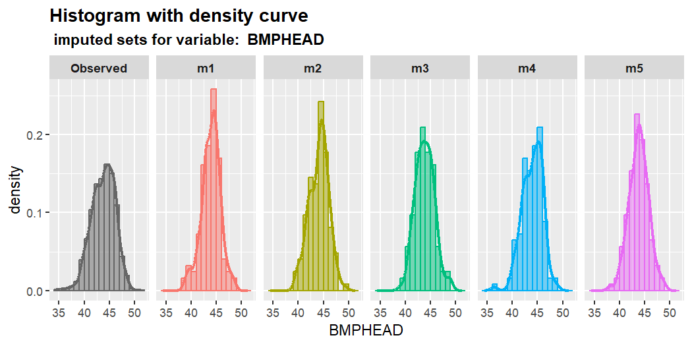
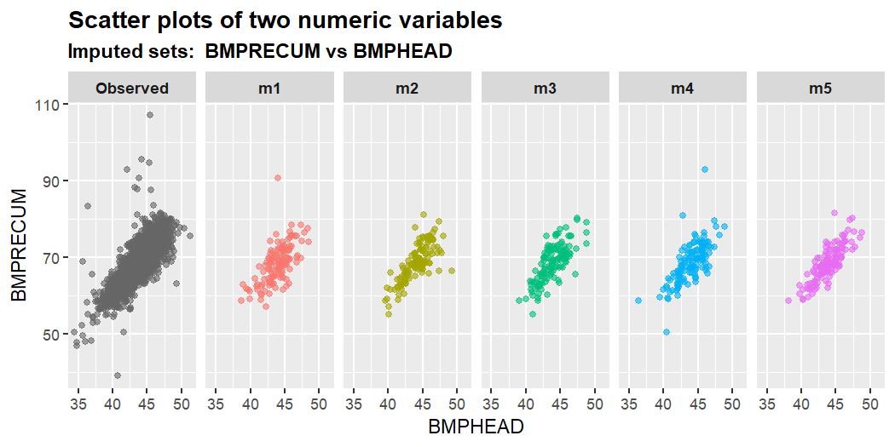
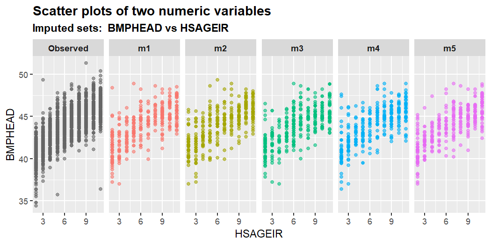
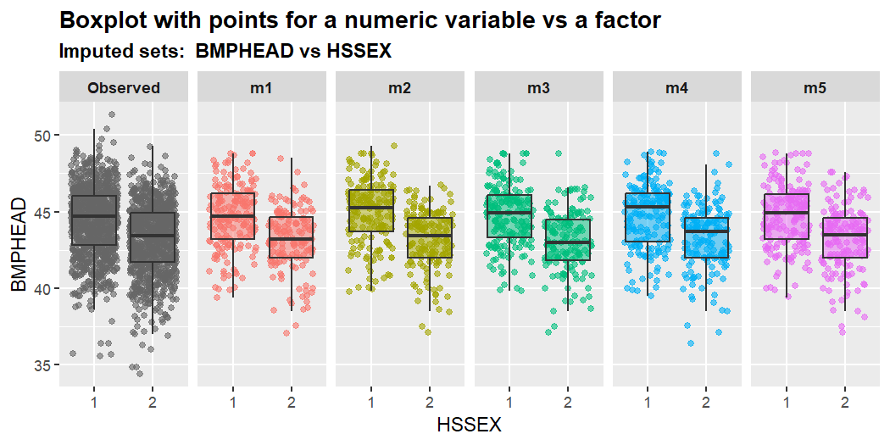

<!-- README.md is generated from README.Rmd. Please edit that file -->

# mixgb

<!-- badges: start -->

[](https://github.com/agnesdeng/mixgb)
[](https://github.com/agnesdeng/mixgb)
[](https://cran.r-project.org/package=mixgb)
[](https://github.com/agnesdeng/mixgb)
[](https://github.com/agnesdeng/mixgb/actions/workflows/R-CMD-check.yaml)
<!-- badges: end -->

The R package `mixgb` provides a scalable solution for multiple
imputation that utilizes XGBoost, subsampling and predictive mean
matching. We have shown that our framework obtains less biased estimates
and reflects appropriate imputation variability, while achieving high
computational efficiency. For further information, please refer to our
paper <https://arxiv.org/abs/2106.01574>.

## New updates

**May 2023**

- Support logical data automatically without the need to convert it to
  factor type.

Now `mixgb(data,...)` support a dataset with the following data types:

    - numeric

    - integer

    - factor

    - logical

Please note that variables of character type need to be manually
converted to factor by the user first.

**January 2023**

- Major change of default settings for mixgb().

Our package has changed from using bootstrapping to subsampling with a
default setting of `subsample = 0.7`. After further investigations, we
discovered that although bootstrapping often works effectively, it can
introduce bias in certain situations. As a result, we have made
subsampling the default method instead of bootstrapping.

**May 2022**

- Visual diagnostic functions of multiply imputed data
- Use S3 instead of R6
- Plot functions can show masked missing data (if provided)

**April 2022**

- User can now set different number of iterations `maxit`.
- Both single and multiple imputation with XGBoost can do predictive
  mean matching
- Bootstrap data to make `m` imputations is optional. Users can set
  `bootstrap = FALSE` to disable bootstrap. Users can also set
  sampling-related hyperparameters of XGBoost (subsample,
  colsample_bytree, colsample_bylevel, colsample_bynode) to be less than
  1 to achieve a similar effect.
- Add predicted mean matching type 0. Now the options for `pmm.type` are
  `NULL`,`0`,`1`,`2` or `"auto"` (type 2 for numeric/integer variables,
  no PMM for categorical variables).
- Added more validation checks
- Compatible with `data.table`
- Cross-validation to pre-tune `nrounds`

## Under development

- make m imputation parallel
- pre-tune other hyperparameters

## Notice

- Users can set XGBoost parameter `nthread` for multithreading with
  OpenMP support. However, OpenMP support has been presently disabled on
  MacOS.

## 1. Installation

You can install the development version of mixgb from
[GitHub](https://github.com/) with:

``` r
# install.packages("devtools")
devtools::install_github("agnesdeng/mixgb")
```

``` r
# load mixgb
library(mixgb)
```

### 1.1 Data cleaning before imputation

It is highly recommended to clean and check your data before imputation.
Here are some common issues:

- Data should be a data frame.
- ID should be removed
- Missing values should be coded as `NA` not `NaN`
- `Inf` or `-Inf` are not allowed
- Empty cells should be coded as `NA` or sensible values
- Variables of “character” type should be converted to “factor” instead
- Variables of “factor” type should have at least two levels

The function `data_clean()` serves the purpose of performing a
preliminary check and fix some evident issues. However, the function
cannot resolve all data quality-related problems.

``` r
cleanWithNA.df <- data_clean(rawdata)
```

## 2. Impute missing values with `mixgb`

We first load the `mixgb` package and the `nhanes3_newborn` dataset,
which contains 16 variables of various types
(integer/numeric/factor/ordinal factor). There are 9 variables with
missing values.

``` r
str(nhanes3_newborn)
#> tibble [2,107 × 16] (S3: tbl_df/tbl/data.frame)
#>  $ HSHSIZER: int [1:2107] 4 3 5 4 4 3 5 3 3 3 ...
#>  $ HSAGEIR : int [1:2107] 2 5 10 10 8 3 10 7 2 7 ...
#>  $ HSSEX   : Factor w/ 2 levels "1","2": 2 1 2 2 1 1 2 2 2 1 ...
#>  $ DMARACER: Factor w/ 3 levels "1","2","3": 1 1 2 1 1 1 2 1 2 2 ...
#>  $ DMAETHNR: Factor w/ 3 levels "1","2","3": 3 1 3 3 3 3 3 3 3 3 ...
#>  $ DMARETHN: Factor w/ 4 levels "1","2","3","4": 1 3 2 1 1 1 2 1 2 2 ...
#>  $ BMPHEAD : num [1:2107] 39.3 45.4 43.9 45.8 44.9 42.2 45.8 NA 40.2 44.5 ...
#>   ..- attr(*, "label")= chr "Head circumference (cm)"
#>  $ BMPRECUM: num [1:2107] 59.5 69.2 69.8 73.8 69 61.7 74.8 NA 64.5 70.2 ...
#>   ..- attr(*, "label")= chr "Recumbent length (cm)"
#>  $ BMPSB1  : num [1:2107] 8.2 13 6 8 8.2 9.4 5.2 NA 7 5.9 ...
#>   ..- attr(*, "label")= chr "First subscapular skinfold (mm)"
#>  $ BMPSB2  : num [1:2107] 8 13 5.6 10 7.8 8.4 5.2 NA 7 5.4 ...
#>   ..- attr(*, "label")= chr "Second subscapular skinfold (mm)"
#>  $ BMPTR1  : num [1:2107] 9 15.6 7 16.4 9.8 9.6 5.8 NA 11 6.8 ...
#>   ..- attr(*, "label")= chr "First triceps skinfold (mm)"
#>  $ BMPTR2  : num [1:2107] 9.4 14 8.2 12 8.8 8.2 6.6 NA 10.9 7.6 ...
#>   ..- attr(*, "label")= chr "Second triceps skinfold (mm)"
#>  $ BMPWT   : num [1:2107] 6.35 9.45 7.15 10.7 9.35 7.15 8.35 NA 7.35 8.65 ...
#>   ..- attr(*, "label")= chr "Weight (kg)"
#>  $ DMPPIR  : num [1:2107] 3.186 1.269 0.416 2.063 1.464 ...
#>   ..- attr(*, "label")= chr "Poverty income ratio"
#>  $ HFF1    : Factor w/ 2 levels "1","2": 2 2 1 1 1 2 2 1 2 1 ...
#>  $ HYD1    : Ord.factor w/ 5 levels "1"<"2"<"3"<"4"<..: 1 3 1 1 1 1 1 1 2 1 ...
colSums(is.na(nhanes3_newborn))
#> HSHSIZER  HSAGEIR    HSSEX DMARACER DMAETHNR DMARETHN  BMPHEAD BMPRECUM 
#>        0        0        0        0        0        0      124      114 
#>   BMPSB1   BMPSB2   BMPTR1   BMPTR2    BMPWT   DMPPIR     HFF1     HYD1 
#>      161      169      124      167      117      192        7        0
```

To impute this dataset, we can use the default settings. The default
number of imputed datasets is `m = 5`. Note that we do not need to
convert our data into dgCMatrix or one-hot coding format. Our package
will automatically convert it for you. Variables should be of the
following types: numeric, integer, factor or ordinal factor.

``` r
# use mixgb with default settings
imputed.data <- mixgb(data = nhanes3_newborn, m = 5)
```

### 2.1 Customize imputation settings

We can also customize imputation settings:

- The number of imputed datasets `m`

- The number of imputation iterations `maxit`

- XGBoost hyperparameters and verbose settings. `xgb.params`, `nrounds`,
  `early_stopping_rounds`, `print_every_n` and `verbose`.

- Subsampling ratio. By default, `subsample = 0.7`. Users can change
  this value under the `xgb.params` argument.

- Predictive mean matching settings `pmm.type`, `pmm.k` and `pmm.link`.

- Whether ordinal factors should be converted to integer (imputation
  process may be faster) `ordinalAsInteger`

- Whether or not to use bootstrapping `bootstrap`

- Initial imputation methods for different types of variables
  `initial.num`, `initial.int` and `initial.fac`.

- Whether to save models for imputing newdata `save.models` and
  `save.vars`.

``` r
# Use mixgb with chosen settings
params <- list(max_depth = 5, subsample = 0.9, nthread = 2, tree_method = "hist")

imputed.data <- mixgb(data = nhanes3_newborn, m = 10, maxit = 2,
    ordinalAsInteger = FALSE, bootstrap = FALSE, pmm.type = "auto",
    pmm.k = 5, pmm.link = "prob", initial.num = "normal", initial.int = "mode",
    initial.fac = "mode", save.models = FALSE, save.vars = NULL,
    xgb.params = params, nrounds = 200, early_stopping_rounds = 10,
    print_every_n = 10L, verbose = 0)
```

### 2.2 Tune hyperparameters

Imputation performance can be affected by the hyperparameter settings.
Although tuning a large set of hyperparameters may appear intimidating,
it is often possible to narrowing down the search space because many
hyperparameters are correlated. In our package, the function
`mixgb_cv()` can be used to tune the number of boosting rounds -
`nrounds`. There is no default `nrounds` value in `XGBoost,` so users
are required to specify this value themselves. The default `nrounds` in
`mixgb()` is 100. However, we recommend using `mixgb_cv()` to find the
optimal `nrounds` first.

``` r
params <- list(max_depth = 3, subsample = 0.7, nthread = 2)
cv.results <- mixgb_cv(data = nhanes3_newborn, nrounds = 100,
    xgb.params = params, verbose = FALSE)
cv.results$response
#> [1] "BMPWT"
cv.results$best.nrounds
#> [1] 18
```

By default, `mixgb_cv()` will randomly choose an incomplete variable as
the response and build an XGBoost model with other variables as
explanatory variables using the complete cases of the dataset.
Therefore, each run of `mixgb_cv()` will likely return different
results. Users can also specify the response and covariates in the
argument `response` and `select_features` respectively.

``` r
cv.results <- mixgb_cv(data = nhanes3_newborn, nfold = 10, nrounds = 100,
    early_stopping_rounds = 1, response = "BMPHEAD", select_features = c("HSAGEIR",
        "HSSEX", "DMARETHN", "BMPRECUM", "BMPSB1", "BMPSB2",
        "BMPTR1", "BMPTR2", "BMPWT"), xgb.params = params, verbose = FALSE)

cv.results$best.nrounds
#> [1] 22
```

Let us just try setting `nrounds = cv.results$best.nrounds` in `mixgb()`
to obtain 5 imputed datasets.

``` r
imputed.data <- mixgb(data = nhanes3_newborn, m = 5, nrounds = cv.results$best.nrounds)
```

## 3. Visualize multiply imputed values

It is crucial to assess the plausibility of imputations before doing an
analysis. The `mixgb` package provides several visual diagnostic
functions using `ggplot2` to compare multiply imputed values versus
observed data.

We will demonstrate these functions using the `nhanes3_newborn` dataset.
In the original data, almost all missing values occurred in numeric
variables. Only seven observations are missing in the binary factor
variable `HFF1`.

``` r
library(mixgb)
colSums(is.na(nhanes3_newborn))
#> HSHSIZER  HSAGEIR    HSSEX DMARACER DMAETHNR DMARETHN  BMPHEAD BMPRECUM 
#>        0        0        0        0        0        0      124      114 
#>   BMPSB1   BMPSB2   BMPTR1   BMPTR2    BMPWT   DMPPIR     HFF1     HYD1 
#>      161      169      124      167      117      192        7        0
```

In order to visualize some imputed values for other types of variables,
we create some extra missing values in `HSHSIZER` (integer), `HSAGEIR`
(integer), `HSSEX` (binary factor), `DMARETHN` (multiclass factor) and
`HYD1` (Ordinal factor) under the missing completely at random (MCAR)
mechanism.

``` r
withNA.df <- createNA(data = nhanes3_newborn, var.names = c("HSHSIZER",
    "HSAGEIR", "HSSEX", "DMARETHN", "HYD1"), p = 0.1)
colSums(is.na(withNA.df))
#> HSHSIZER  HSAGEIR    HSSEX DMARACER DMAETHNR DMARETHN  BMPHEAD BMPRECUM 
#>      211      211      211        0        0      211      124      114 
#>   BMPSB1   BMPSB2   BMPTR1   BMPTR2    BMPWT   DMPPIR     HFF1     HYD1 
#>      161      169      124      167      117      192        7      211
```

We then impute this dataset using `mixgb()` with default settings. After
completion, a list of five imputed datasets is assigned to
`imputed.data`. Each imputed dataset will have the same dimension as the
original data.

``` r
imputed.data <- mixgb(data = withNA.df, m = 5)
```

By using the function `show_var()`, we can see the multiply imputed
values of the missing data for a given variable. The function returns a
data.table of `m` columns, each of which represents a set of imputed
values for the variable of interest. Note that the output of this
function only includes the imputed values of missing entries in the
specified variable.

``` r
show_var(imputation.list = imputed.data, var.name = "BMPHEAD",
    original.data = withNA.df)
#>        m1   m2   m3   m4   m5
#>   1: 44.6 41.9 42.0 40.2 43.5
#>   2: 47.6 46.0 44.7 44.1 45.8
#>   3: 42.2 44.0 41.9 43.2 42.8
#>   4: 43.8 45.9 46.7 46.7 45.2
#>   5: 44.7 42.0 42.6 44.2 42.5
#>  ---                         
#> 120: 46.7 44.6 43.8 45.3 47.2
#> 121: 44.4 45.3 45.6 44.6 43.8
#> 122: 41.8 42.0 42.4 40.8 40.8
#> 123: 43.6 45.1 42.9 45.2 45.8
#> 124: 46.6 44.4 44.8 45.0 43.9
show_var(imputation.list = imputed.data, var.name = "HFF1", original.data = withNA.df)
#>    m1 m2 m3 m4 m5
#> 1:  2  2  2  2  2
#> 2:  2  2  2  2  2
#> 3:  2  2  2  2  2
#> 4:  2  2  2  2  2
#> 5:  2  1  1  2  1
#> 6:  2  2  2  2  1
#> 7:  2  2  2  1  1
```

The `mixgb` package provides the following visual diagnostics functions:

1)  Single variable: `plot_hist()`, `plot_box()`, `plot_bar()` ;

2)  Two variables: `plot_2num()`, `plot_2fac()`, `plot_1num1fac()` ;

3)  Three variables: `plot_2num1fac()`, `plot_1num2fac()`.

Each function returns `m+1` panels that enable a comparison between the
observed data and `m` sets of imputed values for the missing data.

Here are some examples. For more details, please check the vignette on
GitHub [Visual diagnostics for multiply imputed
values](https://agnesdeng.github.io/mixgb/articles/web/Visual-diagnostics.html).

``` r
plot_hist(imputation.list = imputed.data, var.name = "BMPHEAD",
    original.data = withNA.df)
```



``` r
plot_2num(imputation.list = imputed.data, var.x = "BMPHEAD",
    var.y = "BMPRECUM", original.data = withNA.df)
```



``` r
plot_2num(imputation.list = imputed.data, var.x = "HSAGEIR",
    var.y = "BMPHEAD", original.data = withNA.df)
```



``` r
plot_1num1fac(imputation.list = imputed.data, var.num = "BMPHEAD",
    var.fac = "HSSEX", original.data = withNA.df)
```



## 4. Impute new unseen data using a saved imputer object

First, let us split the `nhanes3_newborn` dataset into training data and
test data.

``` r
library(mixgb)
data("nhanes3_newborn")
set.seed(2022)
n <- nrow(nhanes3_newborn)
idx <- sample(1:n, size = round(0.7 * n), replace = FALSE)
train.data <- nhanes3_newborn[idx, ]
test.data <- nhanes3_newborn[-idx, ]
```

We can use the training data to generate `m` imputed datasets and save
their imputation models. To achieve this, users need to set
`save.models = TRUE`. By default, imputation models for all variables
with missing values in the training data will be saved
(`save.vars = NULL`). However, it is possible that unseen data may have
missing values in other variables. To be thorough, users can save models
for all variables by setting `save.vars = colnames(train.data)`. Note
that this may take significantly longer as it requires training and
saving a model for each variable. In cases where users are confident
that only certain variables will have missing values in the new data, it
is advisable to specify the names or indices of these variables in
`save.vars` rather than saving models for all variables.

``` r
# obtain m imputed datasets for train.data and save
# imputation models
mixgb.obj <- mixgb(data = train.data, m = 5, save.models = TRUE,
    save.vars = NULL)
```

When `save.models = TRUE`, `mixgb()` will return an object containing
the following:

- `imputed.data`: a list of `m` imputed datasets for training data

- `XGB.models`: a list of `m` sets of XGBoost models for variables
  specified in `save.vars`.

- `params`: a list of parameters that are required for imputing new data
  using `impute_new()` later on.

We can access the `m` imputed datasets from the saved imputer object by
using `$imputed.data`.

``` r
train.imputed <- mixgb.obj$imputed.data
# the 5th imputed dataset
head(train.imputed[[5]])
#>    HSHSIZER HSAGEIR HSSEX DMARACER DMAETHNR DMARETHN BMPHEAD BMPRECUM BMPSB1
#> 1:        7       2     1        1        1        3    42.1     64.9    6.8
#> 2:        4       3     2        2        3        2    42.6     67.1    8.8
#> 3:        3       9     2        2        3        2    46.5     64.3    8.6
#> 4:        3       9     2        1        3        1    46.2     68.5   10.8
#> 5:        5       4     1        1        3        1    44.7     63.0    6.0
#> 6:        5      10     1        1        3        1    45.2     72.0    5.4
#>    BMPSB2 BMPTR1 BMPTR2 BMPWT DMPPIR HFF1 HYD1
#> 1:    7.8    9.0   10.0  8.45  1.701    2    1
#> 2:    8.8   13.3   12.2  8.70  0.102    2    1
#> 3:    8.0   10.4    9.2  8.00  0.359    1    3
#> 4:   10.0   16.6   16.0  8.98  0.561    1    3
#> 5:    5.8    9.0    9.0  7.60  2.379    2    1
#> 6:    5.4    9.2    9.4  9.00  2.173    2    2
```

To impute new data with this saved imputer object, we can use the
`impute_new()` function. Users can choose whether to use new data for
initial imputation. By default, the information of training data is used
to initially impute the missing data in the new dataset
(`initial.newdata = FALSE`). After this, the missing values in the new
dataset will be imputed using the saved models from the imputer object.
This process will be considerably faster because it will not involve
rebuilding the imputation models.

``` r
test.imputed <- impute_new(object = mixgb.obj, newdata = test.data)
```

If PMM is used in `mixgb()`, predicted values of missing entries in the
new dataset will be matched with donors from the training data.
Additionally, users can set the number of donors to be used in PMM when
imputing new data. The default setting `pmm.k = NULL` indicates that the
same setting as the training object will be used.

Similarly, users can set the number of imputed datasets `m` in
`impute_new()`. Note that this value has to be less than or equal to the
`m` value specified in `mixgb()`. If this value is not specified, the
function will use the same `m` value as the saved object.

``` r
test.imputed <- impute_new(object = mixgb.obj, newdata = test.data,
    initial.newdata = FALSE, pmm.k = 3, m = 4)
```

## 5. Install `mixgb` with GPU support

Multiple imputation can be run with GPU support for machines with NVIDIA
GPUs. Users must first install the R package `xgboost` with GPU support.

The `xgboost` R package pre-built binary on Linux x86_64 with GPU
support can be downloaded from the release page
<https://github.com/dmlc/xgboost/releases/tag/v1.4.0>

The package can then be installed by running the following commands:

    # Install dependencies
    $ R -q -e "install.packages(c('data.table', 'jsonlite'))"

    # Install XGBoost
    $ R CMD INSTALL ./xgboost_r_gpu_linux.tar.gz

Then users can install package `mixgb` in R.

``` r
devtools::install_github("agnesdeng/mixgb")
library(mixgb)
```

To utilize the GPU version of mixgb(), users can simply specify
`tree_method = "gpu_hist"` in the params list which will then be passed
to the `xgb.params` argument in the function `mixgb()`. Other adjustable
GPU-realted arguments include `gpu_id` and `predictor`. By default,
`gpu_id = 0` and `predictor = "auto"`.

``` r
params <- list(max_depth = 3, subsample = 0.7, nthread = 1, tree_method = "gpu_hist",
    gpu_id = 0, predictor = "auto")


mixgb.data <- mixgb(data = withNA.df, m = 5, xgb.params = params)
```
