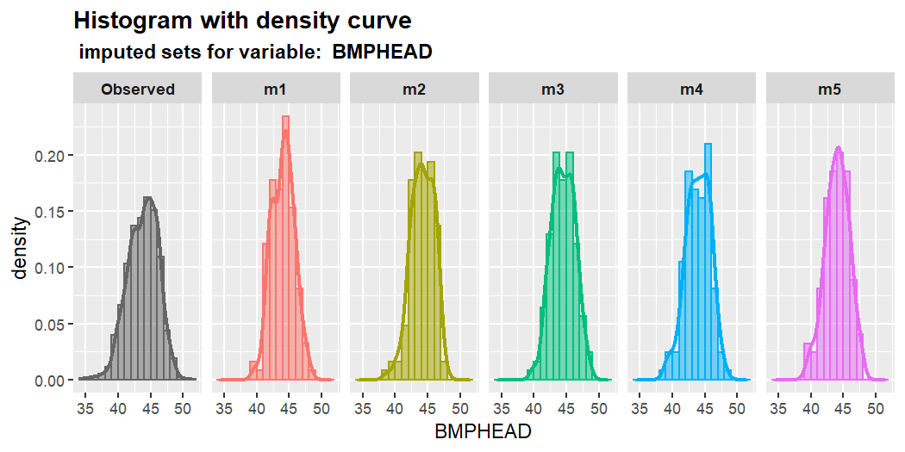
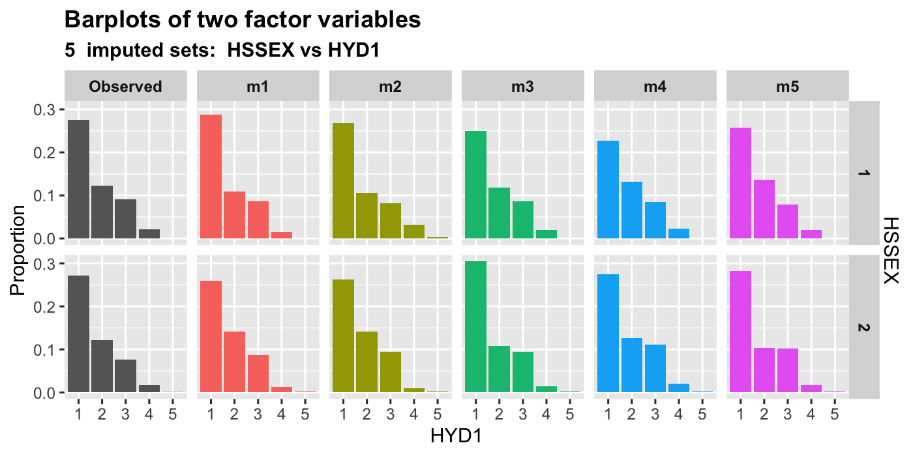

<!-- README.md is generated from README.Rmd. Please edit that file -->

# mixgb

<!-- badges: start -->

[](https://github.com/agnesdeng/mixgb)
[](https://github.com/agnesdeng/mixgb)
[](https://github.com/agnesdeng/mixgb)
<!-- badges: end -->

`mixgb` is a scalable multiple imputation framework based on XGBoost,
bootstrapping and predictive mean matching. The proposed framework is
implemented in an R package `mixgb`. We have shown that our framework
obtains less biased estimates and reflects appropriate imputation
variability, while achieving high computational efficiency. For more
details, please check our paper <https://arxiv.org/abs/2106.01574>. (Our
package has been revised and updated since the preprint was posted.
Simulation code in the original supplementary files may not run as
expected. Revised paper and adapted code will be updated soon.)

## New updates

**May 2022**

-   Visual diagnostic functions of multiply imputed data

**April 2022**

-   User can now set different number of iterations `maxit`.
-   Both single and multiple imputation with XGBoost can do predictive
    mean matching
-   Bootstrap data to make `m` imputations is optional. User can set
    `bootstrap = FALSE` to disable bootstrap. Users can also set
    sampling related hyperparameters of XGBoost (subsample,
    colsample\_bytree, colsample\_bylevel, colsample\_bynode) to be less
    than 1 to achieve similar effect.
-   Add predicted mean matching type 0. Now the options for `pmm.type`
    are `NULL`,`0`,`1`,`2` or `"auto"` (type 2 for numeric/integer
    variables, no PMM for categorical variables).
-   Added more validation checks
-   Compatible with `data.table`
-   Cross-validation to pre-tune `nrounds`

## Under development

-   make m imputation parallel
-   pre-tune other hyperparameters

## Notice

-   Currently users can set XGBoost parameter `nthread` for
    multithreading with OpenMP support. However, MacOS has disabled
    OpenMP support.

## Installation

You can install the development version of mixgb from
[GitHub](https://github.com/) with:

``` r
# install.packages("devtools")
devtools::install_github("agnesdeng/mixgb")
```

## Data cleaning before imputation

It is highly recommended to clean and check your data before imputation.
Here are some common issues:

-   Data should be a data frame.
-   ID should be removed
-   Missing values should be coded as `NA` not `NaN`
-   `Inf` or `-Inf` are not allowed
-   Empty cells should be coded as `NA` or sensible values
-   Variables of “character” type should be converted to “factor”
    instead
-   Variables of “factor” type should have at least two levels

The function `data_clean()` can do a preliminary check and fix some
obvious problems. However, it would not fix all issues related to data
quality.

``` r
library(mixgb)
cleanWithNA.df <- data_clean(rawdata)
```

## Imputing missing values with `mixgb`

We first load the `mixgb` package and the `nhanes3_newborn` dataset,
which contains 16 variables of various types
(integer/numeric/factor/ordinal factor). There are 9 variables with
missing values.

``` r
library(mixgb)
data(nhanes3_newborn)
colSums(is.na(nhanes3_newborn))
#> HSHSIZER  HSAGEIR    HSSEX DMARACER DMAETHNR DMARETHN  BMPHEAD BMPRECUM 
#>        0        0        0        0        0        0      124      114 
#>   BMPSB1   BMPSB2   BMPTR1   BMPTR2    BMPWT   DMPPIR     HFF1     HYD1 
#>      161      169      124      167      117      192        7        0
```

``` r
# use mixgb with default settings
MIXGB <- Mixgb$new(data = nhanes3_newborn)
imputed.data <- MIXGB$impute(m = 5, maxit = 1)
```

To impute this dataset, first we need to set up an Mixgb imputer with
our choice of settings or leave it as default. Note that we do not need
to convert our data into dgCMatrix or one-hot coding format. Our package
will convert it automatically. Variables should be of the following
types: numeric, integer, factor or ordinal factor. Except `data`, other
arguments in `Mixgb$new( )` are either hyperparameters or verbose
settings for XGBoost training.

``` r
# Set up mixgb imputer with chosen settings
params = list(max_depth = 6, gamma = 0.1, eta = 0.3, min_child_weight = 1,
    subsample = 1, colsample_bytree = 1, colsample_bylevel = 1,
    colsample_bynode = 1, nthread = 4, tree_method = "auto",
    gpu_id = 0, predictor = "auto")

MIXGB <- Mixgb$new(data = nhanes3_newborn, xgb.params = params,
    nrounds = 100, early_stopping_rounds = 1, print_every_n = 1,
    verbose = 0)
```

### Tune hyperparameters

Imputation performance can be affected by the hyperparameter settings.
It may seem daunting to tune a large set of hyperparameters, but often
we can narrow down the search as many hyperparameters are correlated. In
our package, we have a function `mixgb_cv()` to tune `nrounds`. There is
no default `nrounds` value in `XGBoost,` so we need to specify it. The
default `nrounds` in `mixgb` is 50. However, we recommend using
`mixgb_cv()` to find the optimal `nrounds` first.

``` r
optimal.nrounds <- mixgb_cv(data = nhanes3_newborn, verbose = FALSE)
optimal.nrounds$response
#> [1] "BMPHEAD"
optimal.nrounds$best.nrounds
#> [1] 18
```

By default, `mixgb_cv()` will randomly choose an incomplete variable as
the response and build an XGBoost model with other variables using the
complete cases of the dataset. Therefore, each run of `mixgb_cv()` is
likely to return different results. Users can also specify the response
and covariates in the argument `response` and `select_covariates`,
respectively.

``` r
optimal.nrounds <- mixgb_cv(data = nhanes3_newborn, nfold = 10,
    nrounds = 100, early_stopping_rounds = 1, response = "BMPHEAD",
    select_covariates = c("HSHSIZER", "HSAGEIR", "HSSEX", "DMARETHN",
        "BMPRECUM", "BMPSB1", "BMPSB2", "BMPTR1", "BMPTR2", "BMPWT",
        "DMPPIR", "HFF1", "HYD1"), verbose = FALSE)

optimal.nrounds$best.nrounds
#> [1] 18
```

Since the results returned by `mixgb_cv()` are mostly less than 20, I’ll
set `nrounds = 20` in the imputer. We now use this imputer to obtain m
imputed datasets, which will be stored in a list of `m` data tables. If
`m = 1`, single imputation will be undertaken. Users can also specify
the number of imputation iterations `maxit`.

``` r
MIXGB <- Mixgb$new(data = nhanes3_newborn, nrounds = 20)
imputed.data <- MIXGB$impute(m = 5, maxit = 1)
```

### Customise imputation settings

We can also customise other imputation settings:

-   Whether to use bootstrapping

-   The types of predictive mean matching

-   The number of donors for predictive mean matching

-   Whether to convert ordinal factors to integer (imputation process
    will be faster)

-   Initial imputation methods for different types of variables

``` r
imputed.data <- MIXGB$impute(m = 5, maxit = 1, bootstrap = TRUE,
    pmm.type = "auto", pmm.k = 5, ordinalAsInteger = TRUE, initial.num = "normal",
    initial.int = "sample", initial.fac = "mode")
```

## Visualize multiply imputed values

It is important to assess the plausibility of imputations before doing
analysis. The `mixgb` package provides several visual diagnostic
functions using `ggplot2` to compare multiply imputed values versus
observed data.

We will demonstrate these functions using the `nhanes3_newborn` dataset.
In the original data, almost all missing values occurred in numeric
variables. Only seven observations are missing in the binary factor
variable `HFF1` . In order to visualize some imputed values for other
types of variables, we create some extra missing values in `HSHSIZER`
(integer), `HSAGEIR` (integer), `HSSEX` (binary factor), `DMARETHN`
(multiclass factor) and `HYD1` (Ordinal factor) under MCAR.

``` r
withNA.df <- createNA(data = nhanes3_newborn, var.names = c("HSHSIZER",
    "HSAGEIR", "HSSEX", "DMARETHN", "HYD1"), p = 0.1)
colSums(is.na(withNA.df))
#> HSHSIZER  HSAGEIR    HSSEX DMARACER DMAETHNR DMARETHN  BMPHEAD BMPRECUM 
#>      211      211      211        0        0      211      124      114 
#>   BMPSB1   BMPSB2   BMPTR1   BMPTR2    BMPWT   DMPPIR     HFF1     HYD1 
#>      161      169      124      167      117      192        7      211
```

We then impute this dataset using `mixgb` with default settings. A list
of five imputed datasets are assigned to `imputed.data`. The dimension
of each imputed dataset will be the same as the original data.

``` r
MIXGB <- Mixgb$new(data = withNA.df)
imputed.data <- MIXGB$impute(m = 5)
#> mixgb with bootstrap: imputing set -- 1 -- 2 -- 3 -- 4 -- 5
```

The `mixgb` package provides the following visual diagnostics functions:

1.  Single variable: `plot_hist()`, `plot_box()`, `plot_bar()` ;

2.  Two variables: `plot_2num()`, `plot_2fac()`, `plot_1num1fac()` ;

3.  Three variables: `plot_2num1fac()`, `plot_1num2fac()`.

Each function will return `m+1` panels to compare the observed data with
`m` sets of actual imputed values.

Here are some examples. For more details, please check the vignettes
`Visual-diagnostics`.

    ```r
    plot_hist(imputation.list = imputed.data, var.num = "BMPHEAD",
        original.data = withNA.df)
    ```

    

    ```r
    plot_2num(imputation.list = imputed.data, var.x = "BMPHEAD",
        var.y = "BMPRECUM", original.data = withNA.df)
    ```

    

    ```r
    plot_2num(imputation.list = imputed.data, var.x = "HSAGEIR",
        var.y = "BMPHEAD", original.data = withNA.df)
    ```

    

    ```r
    plot_1num1fac(imputation.list = imputed.data, var.num = "BMPHEAD",
        var.fac = "HSSEX", original.data = withNA.df)
    ```

    

    ```r
    plot_2fac(imputation.list = imputed.data, var.fac1 = "HYD1",
        var.fac2 = "HSSEX", original.data = withNA.df)
    ```

    

## Impute new unseen data using a trained imputer

First we can split the `nhanes3_newborn` dataset into training data and
test data.

``` r
library(mixgb)
data("nhanes3_newborn")
set.seed(2022)
n <- nrow(nhanes3_newborn)
idx <- sample(1:n, size = round(0.7 * n), replace = FALSE)
train.data <- nhanes3_newborn[idx, ]
test.data <- nhanes3_newborn[-idx, ]
```

We can use the training data to obtain `m` imputed datasets and save
their imputation models. To achieve this, users need to set
`save.models = TRUE`. By default `save.vars = NULL`, imputation models
for variables with missing data in the training data will be saved.
However, the unseen data may also have missing values in other
variables. Users can be comprehensive by saving models for all variables
by setting `save.vars = colnames(train.data)`. Note that this would take
much longer as we need to train and save a model for each variable. If
users are confident that only certain variables will have missing values
in the new data, we recommend specifying the names or indices of these
variables in `save.vars` instead of saving models for all variables.

``` r
MIXGB <- Mixgb$new(data = train.data)
mixgb.obj <- MIXGB$impute(m = 5, maxit = 1, save.models = TRUE,
    save.vars = NULL)
```

We can extract `m` imputed datasets from the saved imputer object by
`$imputed.data`.

``` r
imputed.traindata <- mixgb.obj$imputed.data
```

To impute new data with this saved imputer object, we use the
`impute_new()` function. User can also specify whether to use new data
for initial imputation. By default, `initial.newdata = FALSE`, we will
use the information of training data to initially impute the new data.
New data will be imputed with the saved models. This process will be
considerably faster as we don’t need to build the imputation models
again.

``` r
imputed.testdata <- impute_new(object = mixgb.obj, newdata = test.data)
```

If PMM is used in the trained imputer, predicted values of missing
entries in the new dataset are matched with donors from training data.
Users can also set the number of donors for PMM when imputing new data.
By default, `pmm.k = NULL` , which means the same setting as the
training object will be used.

Similarly, users can set the number of imputed datasets `m`. Note that
this value has to be smaller than or equal to the `m` in the trained
imputer. If it is not specified, it will use the same `m` value as the
trained imputer.

``` r
imputed.testdata <- impute_new(object = mixgb.obj, newdata = test.data,
    initial.newdata = FALSE, pmm.k = 3, m = 4)
```

## Install `mixgb` with GPU support

Multiple imputation can be run with GPU support for machines with NVIDIA
GPUs. Note that users have to install the R package `xgboost` with GPU
support first.

The xgboost R package pre-built binary on Linux x86\_64 with GPU
supportcan be downloaded from the release page
<https://github.com/dmlc/xgboost/releases/tag/v1.4.0>

The package can then be installed by running the following commands:
\`\`\` \# Install dependencies $ R -q -e
“install.packages(c(‘data.table’, ‘jsonlite’))”

# Install XGBoost

$ R CMD INSTALL ./xgboost\_r\_gpu\_linux.tar.gz


    Then users can install package `mixgb` in R. 


    ```r
    devtools::install_github("agnesdeng/mixgb")
    library(mixgb)

Users just need to specify `tree_method = "gpu_list"` in the params list
when setting up the Mixgb imputer. Other GPU-realted arguments include
`gpu_id` and `predictor`. By default, `gpu_id = 0` and
`predictor = "auto"`.

``` r
params = list(max_depth = 6, gamma = 0.1, eta = 0.3, min_child_weight = 1,
    subsample = 1, colsample_bytree = 1, colsample_bylevel = 1,
    colsample_bynode = 1, nthread = 4, tree_method = "gpu_list",
    gpu_id = 0, predictor = "auto")

MIXGB <- Mixgb$new(withNA.df, xgb.params = params)

mixgb.data <- MIXGB$impute(m = 5)
```
