# Visual diagnostics for multiply imputed values

## 1. Introduction

It is crucial to assess the plausibility of imputations before doing an
analysis. The `mixgb` package provides several visual diagnostic
functions using `ggplot2` to compare multiply imputed values versus
observed data.

### 1.1 Inspecting imputed values

We will demonstrate these functions using the `nhanes3_newborn` dataset.
In the original data, almost all missing values occurred in numeric
variables. Only seven observations are missing in the binary factor
variable `HFF1`.

``` r
library(mixgb)
colSums(is.na(nhanes3_newborn))
#> HSHSIZER  HSAGEIR    HSSEX DMARACER DMAETHNR DMARETHN  BMPHEAD BMPRECUM 
#>        0        0        0        0        0        0      124      114 
#>   BMPSB1   BMPSB2   BMPTR1   BMPTR2    BMPWT   DMPPIR     HFF1     HYD1 
#>      161      169      124      167      117      192        7        0
```

In order to visualize some imputed values for other types of variables,
we create some extra missing values in `HSHSIZER` (integer), `HSAGEIR`
(integer), `HSSEX` (binary factor), `DMARETHN` (multiclass factor) and
`HYD1` (Ordinal factor) under the missing completely at random (MCAR)
mechanism.

``` r
withNA.df <- createNA(data = nhanes3_newborn, var.names = c("HSHSIZER", "HSAGEIR", "HSSEX", "DMARETHN", "HYD1"), p = 0.1)
colSums(is.na(withNA.df))
#> HSHSIZER  HSAGEIR    HSSEX DMARACER DMAETHNR DMARETHN  BMPHEAD BMPRECUM 
#>      211      211      211        0        0      211      124      114 
#>   BMPSB1   BMPSB2   BMPTR1   BMPTR2    BMPWT   DMPPIR     HFF1     HYD1 
#>      161      169      124      167      117      192        7      211
```

We then impute this dataset using [`mixgb()`](../../reference/mixgb.md)
with default settings. After completion, a list of five imputed datasets
is assigned to `imputed.data`. Each imputed dataset will have the same
dimension as the original data.

``` r
imputed.data <- mixgb(data = withNA.df, m = 5, pmm.type = "auto")
```

By using the function [`show_var()`](../../reference/show_var.md), we
can see the multiply imputed values of the missing data for a given
variable. The function returns a data.table of `m` columns, each of
which represents a set of imputed values for the variable of interest.
Note that the output of this function only includes the imputed values
of missing entries in the specified variable.

``` r
show_var(imputation.list = imputed.data, var.name = "BMPHEAD", original.data = withNA.df)
#>         m1    m2    m3    m4    m5
#>      <num> <num> <num> <num> <num>
#>   1:  46.6  46.1  46.4  44.9  45.6
#>   2:  46.0  44.7  44.4  43.0  43.0
#>   3:  42.0  42.8  43.5  43.8  45.1
#>   4:  45.1  42.4  45.8  44.9  44.3
#>   5:  46.1  47.7  47.2  47.5  44.6
#>  ---                              
#> 120:  46.9  46.2  46.3  44.9  46.9
#> 121:  44.0  46.2  42.9  45.1  45.3
#> 122:  40.4  41.3  42.4  41.2  41.0
#> 123:  45.8  45.1  45.9  44.7  45.0
#> 124:  44.5  43.8  47.5  44.4  43.6
show_var(imputation.list = imputed.data, var.name = "HFF1", original.data = withNA.df)
#>        m1     m2     m3     m4     m5
#>    <fctr> <fctr> <fctr> <fctr> <fctr>
#> 1:      2      2      2      2      2
#> 2:      1      1      1      1      1
#> 3:      2      2      2      2      2
#> 4:      1      2      1      2      1
#> 5:      1      2      1      1      2
#> 6:      2      2      2      2      2
#> 7:      2      2      2      2      2
```

## 2 Visual diagnostics plots

The `mixgb` package provides the following visual diagnostics functions:

1.  Single variable: [`plot_hist()`](../../reference/plot_hist.md),
    [`plot_box()`](../../reference/plot_box.md),
    [`plot_bar()`](../../reference/plot_bar.md) ;

2.  Two variables: [`plot_2num()`](../../reference/plot_2num.md),
    [`plot_2fac()`](../../reference/plot_2fac.md),
    [`plot_1num1fac()`](../../reference/plot_1num1fac.md) ;

3.  Three variables:
    [`plot_2num1fac()`](../../reference/plot_2num1fac.md),
    [`plot_1num2fac()`](../../reference/plot_1num2fac.md).

Each function returns `m+1` panels that enable a comparison between the
observed data and `m` sets of imputed values for the missing data.

Users can also simply use high-level functions
[`plot1D()`](../../reference/plot1D.md),
[`plot2D()`](../../reference/plot2D.md) and
[`plot3D()`](../../reference/plot3D.md). These functions will
automatically call the corresponding low-level functions based on the
types of variables.

### 2.1 Single variable

Only imputed values of missing entries in the specified variable will be
plotted in panels `m1` to `m5`. An error message will be displayed if
the variable is fully observed and there are no missing entries to
impute.

#### 2.1.1 Numeric

We can plot an imputed numeric variable by histogram or boxplot.

- [`plot_hist()`](../../reference/plot_hist.md): plot histograms with
  density curves.

  Histograms are a useful tool for displaying the distribution of
  numeric data. Users can examine the shapes of the histograms to
  identify any unusual patterns in the imputed values. If the data is
  missing completely at random (MCAR), we would expect the distribution
  of imputed values to be the same as that of the observed values.
  However, if the data is missing at random (MAR), the distributions of
  observed and imputed values can be quite different. Nevertheless, it
  is still worth plotting the imputed data, as any unusual values may
  indicate that the imputation procedure is unsatisfactory.

  ``` r
  plot_hist(
    imputation.list = imputed.data, var.name = "BMPHEAD",
    original.data = withNA.df
  )
  ```

  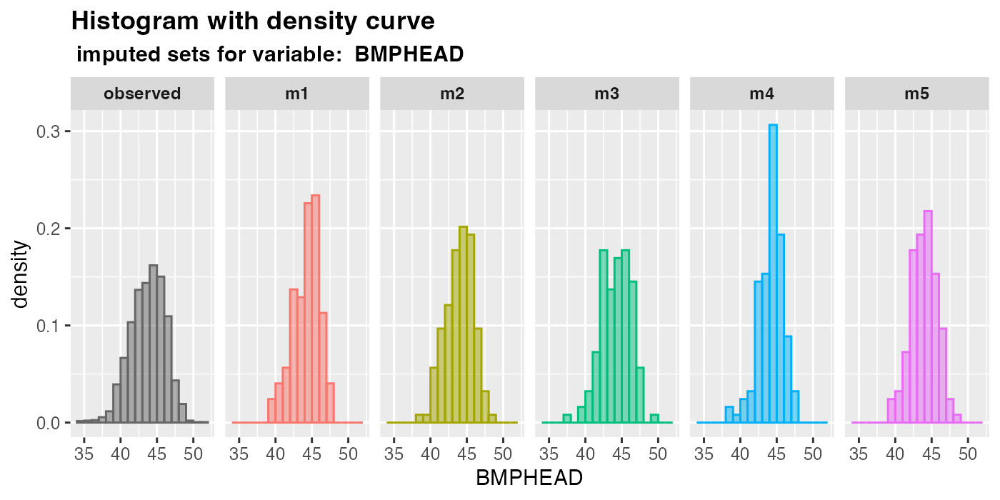

- [`plot_box()`](../../reference/plot_box.md): plot box plots with
  overlaying data points.

  Users can use [`plot_box()`](../../reference/plot_box.md) to compare
  the median, lower and upper quantiles of imputed values with those of
  the observed values. The plot also visually displays the disparity in
  counts between observed and missing values in the variable of
  interest.

  ``` r
  plot_box(
    imputation.list = imputed.data, var.name = "BMPHEAD",
    original.data = withNA.df
  )
  ```

  

#### 2.1.2 Factor

- [`plot_bar()`](../../reference/plot_bar.md): plot bar plots

  The proportion of each level in a factor will be shown by
  [`plot_bar()`](../../reference/plot_bar.md).

  ``` r
  plot_bar(
    imputation.list = imputed.data, var.name = "HSSEX",
    original.data = withNA.df
  )
  ```

  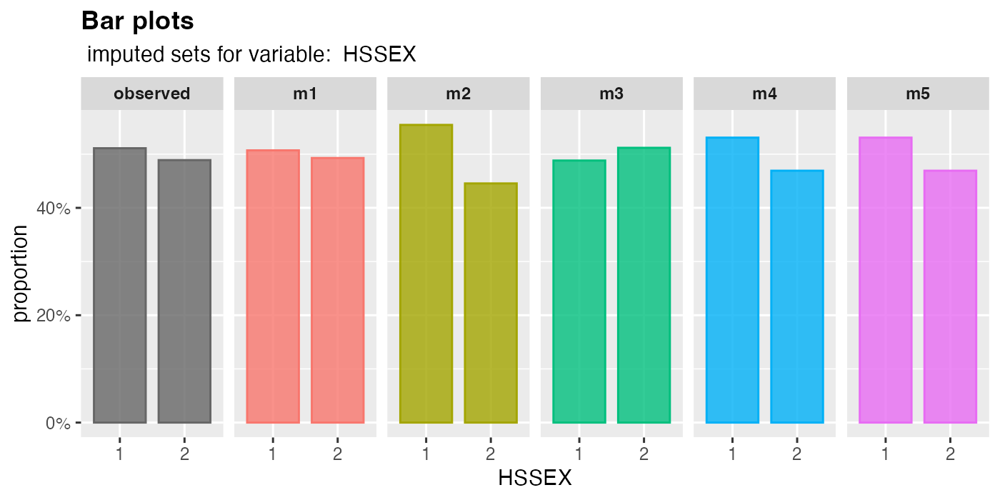

  ``` r
  plot_bar(
    imputation.list = imputed.data, var.name = "DMARETHN",
    original.data = withNA.df
  )
  ```

  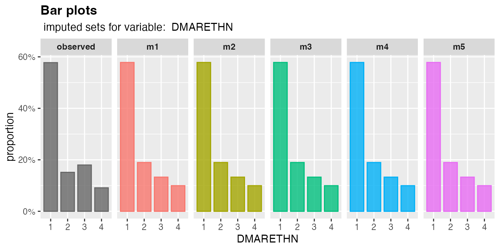

#### 2.1.3 Integer

Users have the flexibility to choose how to treat integer variables when
generating a plot, as they can be viewed either as numeric or factor
variables. To plot an imputed integer variable, users can use one of the
following functions based on their preferred representation:

- [`plot_hist()`](../../reference/plot_hist.md): plot histograms with
  density curves

- [`plot_box()`](../../reference/plot_box.md): plot box plot with
  overlaying data points

- [`plot_bar()`](../../reference/plot_bar.md): plot bar plot (treat an
  integer variable as a factor)

  ``` r
  plot_hist(
    imputation.list = imputed.data, var.name = "HSHSIZER",
    original.data = withNA.df
  )
  ```

  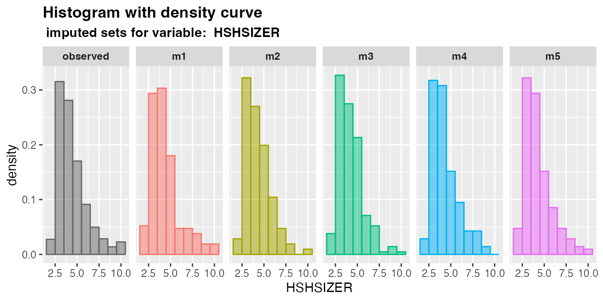

  ``` r
  plot_box(
    imputation.list = imputed.data, var.name = "HSHSIZER",
    original.data = withNA.df
  )
  ```

  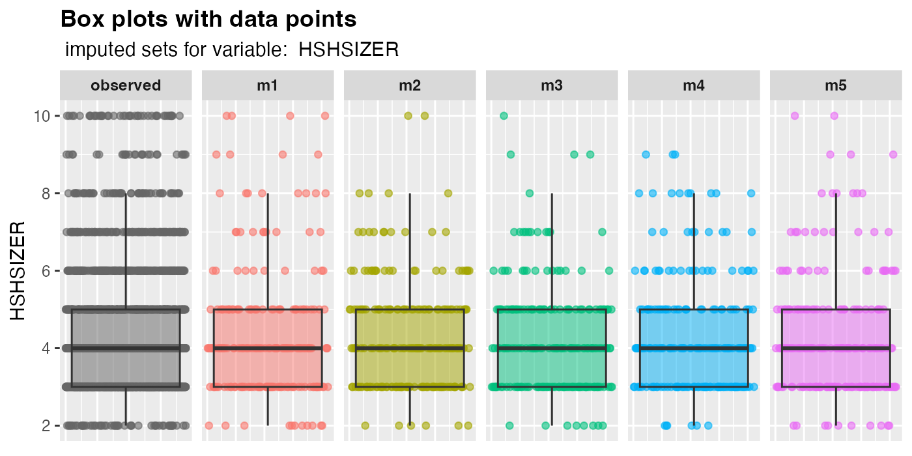

  ``` r
  plot_bar(
    imputation.list = imputed.data, var.name = "HSHSIZER",
    original.data = withNA.df
  )
  ```

  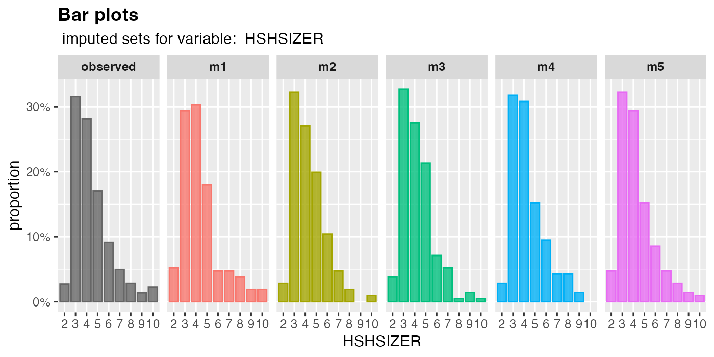

#### 2.1.4 Ordinal factor

By default, the function [`mixgb()`](../../reference/mixgb.md) does not
convert ordinal factors to integers. Therefore, we may simply plot
ordinal factors as factors (see Section 2.1.2).

However, setting `ordinalAsInteger = TRUE` in
[`mixgb()`](../../reference/mixgb.md) may speed up the imputation
process, but users must decide whether to transform them back. If we
choose to convert ordinal factors to integers prior to imputation, the
imputed values must be plotted as if they were integers (see Section
2.1.3).

``` r
imputed.data2 <- mixgb(data = withNA.df, m = 5, ordinalAsInteger = TRUE)

plot_bar(
  imputation.list = imputed.data2, var.name = "HYD1",
  original.data = withNA.df
)
```

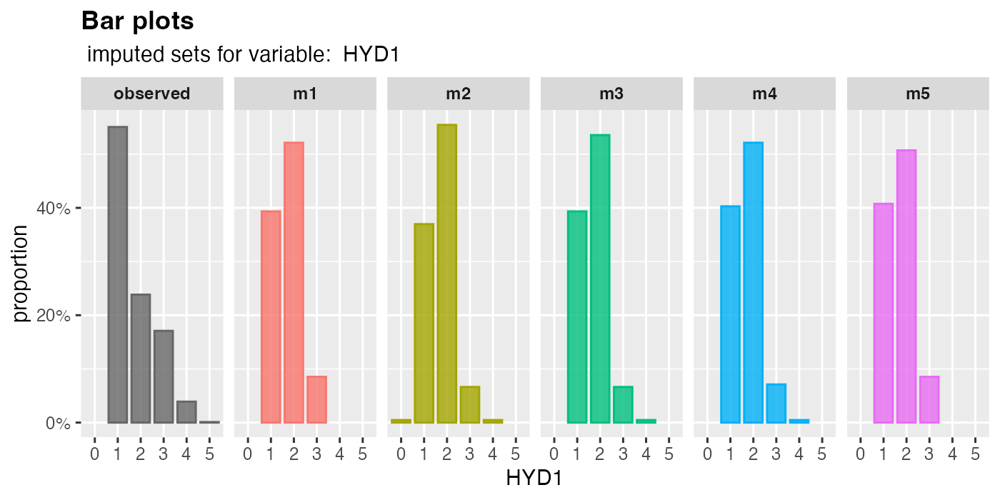

``` r
plot_hist(
  imputation.list = imputed.data2, var.name = "HYD1",
  original.data = withNA.df
)
```


``` r
plot_box(
  imputation.list = imputed.data2, var.name = "HYD1",
  original.data = withNA.df
)
```

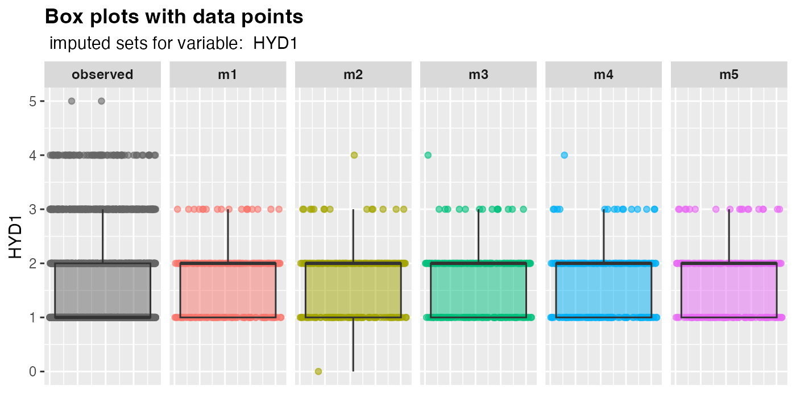

### 2.2 Two variables

All of the functions in this section for visualizing the multiply
imputed values of two variables require at least one of the variables in
the original dataset to be incomplete. The imputed values shown in
panels `m1` to `m5` are those that were originally missing in one or
both of the variables.

#### 2.2.1 Two numeric variables

We can generate scatter plots of two imputed numeric variables by using
[`plot_2num()`](../../reference/plot_2num.md). We can specify the x-axis
variable in `var.x` and the y-axis variable in `var.y`.

Users can choose to plot the shapes of different types of missing values
by setting `shape = TRUE`. We only recommend plotting the shapes for
small datasets. By default, `shape = FALSE` is used to expedite the
plotting process.

``` r
plot_2num(
  imputation.list = imputed.data, var.x = "BMPHEAD", var.y = "BMPRECUM",
  original.data = withNA.df, shape = TRUE
)
```

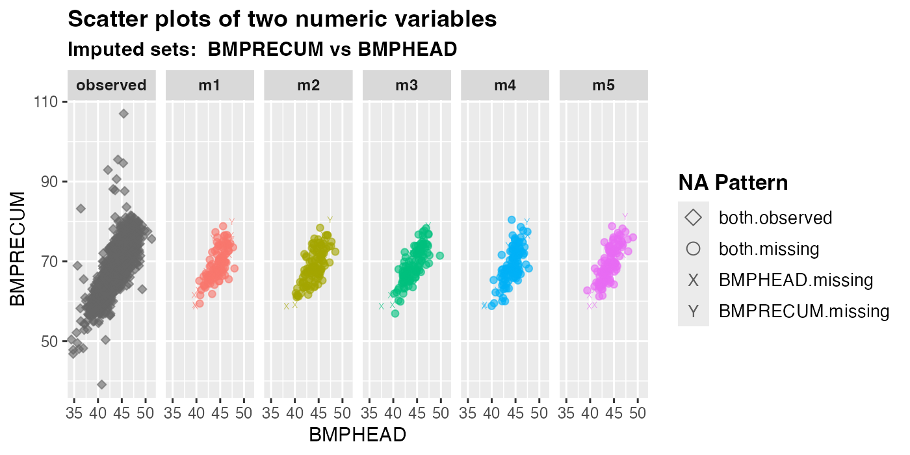

**NA.condition** represents the following four types of missing values.

1.  `both.observed`: Both `var.x` and`var.y` are observed. This only
    appears in the first panel - `Observed` (Shape: diamond).

2.  `both.missing`: Imputed values where both `var.x` and `var.y` are
    originally missing (Shape: circle);

3.  `var.x.missing`: Imputed values where `var.x` is originally missing
    and `var.y` is not (Shape: X);

4.  `var.y.missing`: Imputed values where `var.y` is originally missing
    and `var.x` is not (Shape: Y).

#### 2.2.2 One numeric vs one factor

We can plot a numeric variable versus a factor using
[`plot_1num1fac()`](../../reference/plot_1num1fac.md). The output of
this function is a box plot with overlaying points. Users are required
to specify a numeric variable in `var.num` and a factor in `var.fac`.

**NA.condition** is similar to the definition in Section 2.2.1.

``` r
plot_1num1fac(
  imputation.list = imputed.data, var.num = "BMPHEAD", var.fac = "HSSEX",
  original.data = withNA.df
)
```

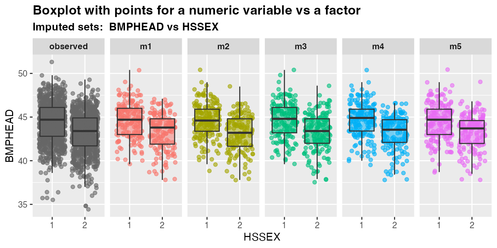

#### 2.2.3 Two factors

We can generate bar plots to show the relationship between two factors
by using [`plot_2fac()`](../../reference/plot_2fac.md).

``` r
plot_2fac(
  imputation.list = imputed.data, var.fac1 = "HYD1", var.fac2 = "HFF1",
  original.data = withNA.df
)
```


#### 2.2.4 One numeric vs one integer

We can use [`plot_2num()`](../../reference/plot_2num.md) to visualize
the relationship between a numeric variable and an integer variable.
Note that the graphs would appear differently if the variables `var.x`
and `var.y` were swapped.

``` r
plot_2num(
  imputation.list = imputed.data, var.x = "BMPHEAD", var.y = "HSAGEIR",
  original.data = withNA.df, shape = TRUE
)
```

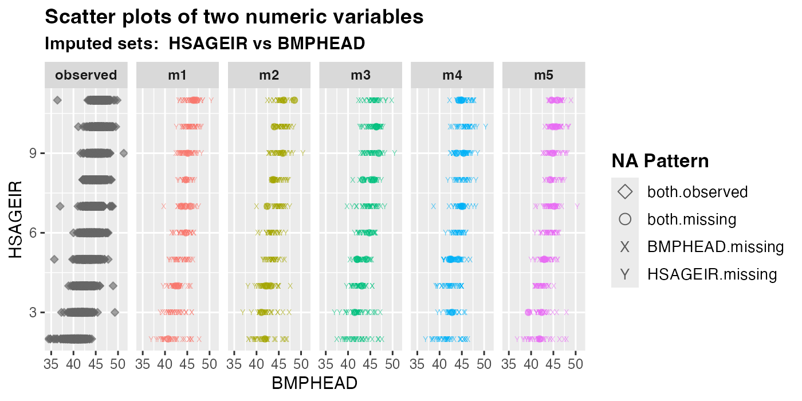

``` r
plot_2num(
  imputation.list = imputed.data, var.x = "HSAGEIR", var.y = "BMPHEAD",
  original.data = withNA.df, shape = TRUE
)
```


If the integer variable `HSAGEIR` is to be treated as a factor rather
than a numeric variable, the function `plot 1num1fac()` can be used.

``` r
plot_1num1fac(
  imputation.list = imputed.data, var.num = "BMPHEAD", var.fac = "HSAGEIR",
  original.data = withNA.df, shape = TRUE
)
```

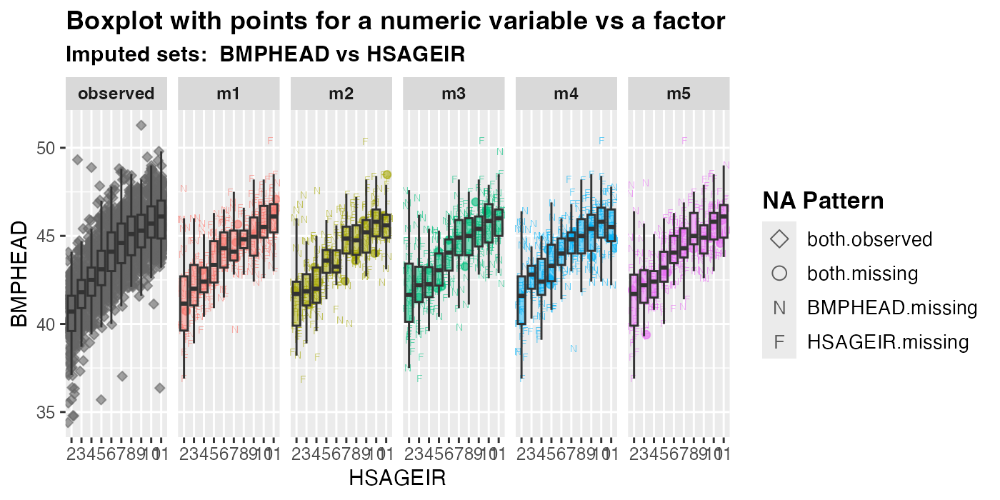

#### 2.2.5 Two integers

We can plot two integer variables using either
[`plot_2num()`](../../reference/plot_2num.md)
,[`plot_1num1fac()`](../../reference/plot_1num1fac.md), or
[`plot_2fac()`](../../reference/plot_2fac.md). Users should choose the
plotting functions based on the nature of the variable. For example, if
an integer variable `age` has values between 0 and 110, it may be more
convenient to treat `age` as numeric rather than a factor. If, on the
other hand, an integer variable has just a few unique values (such as 1,
2, 3), it may be preferable to be plotted as a factor. In this dataset,
there are only two variables of integer type - `HSHSIZER`(household
size) and `HSAGEIR`(baby’s age ranging from 2 to 11 months). Although
there is no expected relationship between these two, we still create a
plot for demonstration purposes.

``` r
plot_2num(
  imputation.list = imputed.data, var.x = "HSHSIZER", var.y = "HSAGEIR",
  original.data = withNA.df, shape = TRUE
)
```

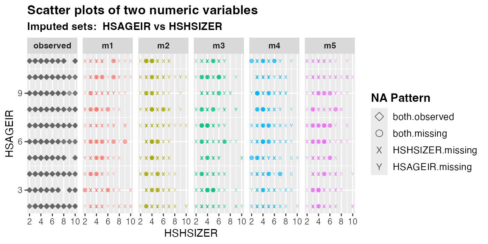

``` r
plot_1num1fac(
  imputation.list = imputed.data, var.num = "HSHSIZER", var.fac = "HSAGEIR",
  original.data = withNA.df, shape = TRUE
)
```

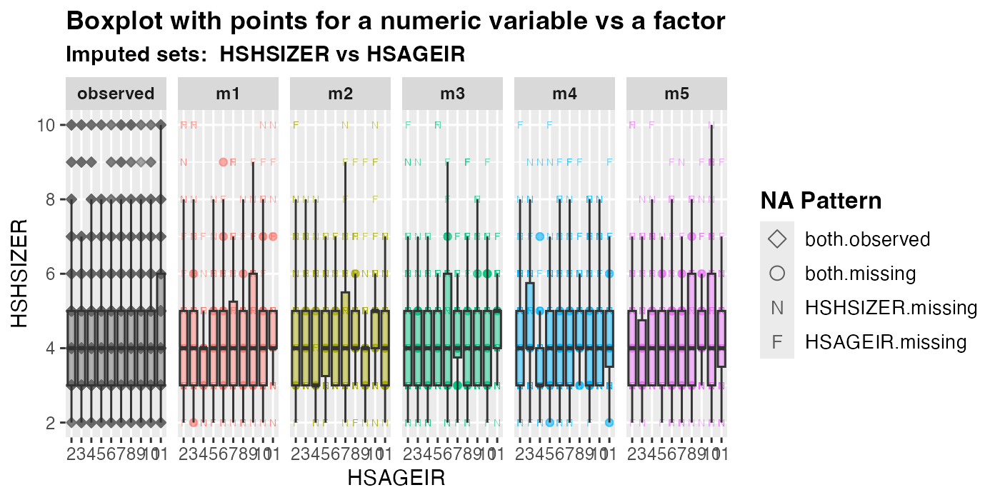

``` r
plot_2fac(
  imputation.list = imputed.data, var.fac1 = "HSHSIZER", var.fac2 = "HSAGEIR",
  original.data = withNA.df
)
```

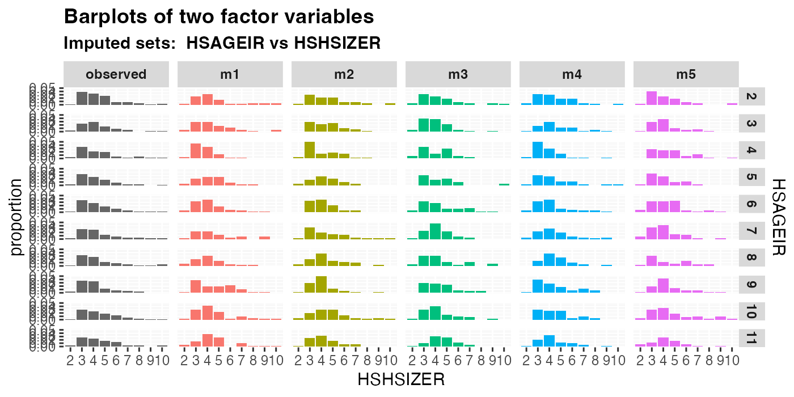

### 2.3 Three variables

To plot the multiply imputed values of three variables, at least one of
them has to be incomplete in the original dataset.

#### 2.3.1 Two numeric variables conditional on one factor

We can generate a scatter plot of two numeric variables when conditioned
on a factor by using
[`plot_2num1fac()`](../../reference/plot_2num1fac.md). The variable for
the x-axis should be specified in `var.x`, whereas the variable for the
y-axis should be specified in `var.y`. The factor on which we want to
condition is `con.fac`.

``` r
plot_2num1fac(
  imputation.list = imputed.data, var.x = "BMPHEAD", var.y = "BMPRECUM",
  con.fac = "HFF1", original.data = withNA.df
)
```

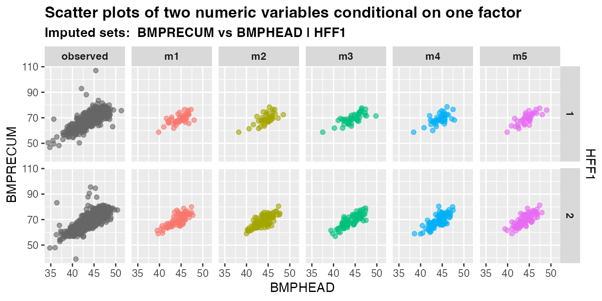

When we have three variables, there are $`2^3`$ different types of
missing patterns. These patterns consist of all possible combinations of
zero to three variables missing. However, attempting to differentiate
all eight types of missingness in the same plot can be challenging,
particularly when working with large datasets. Therefore, we have
decided to display the following three types of missing patterns
(**NA.condition**) in the plot when `shape = TRUE`.

**NA.condition** represents the following three types of missing values.

1.  `all.observed`: Observations where all three variables are observed.
    This only appears in the first panel - `Observed` .

2.  `con.fac.observed`: Imputed values where `con.fac` is originally
    observed.

    (These points are originally missing in either `var.x` or `var.y` or
    both)

3.  `con.fac.missing`: imputed values where `con.fac` is originally
    missing. (These points can be originally observed, or missing in
    either `var.x` or `var.y` or both)

``` r
plot_2num1fac(
  imputation.list = imputed.data, var.x = "BMPHEAD", var.y = "BMPRECUM",
  con.fac = "DMARETHN", original.data = withNA.df, shape = TRUE
)
```

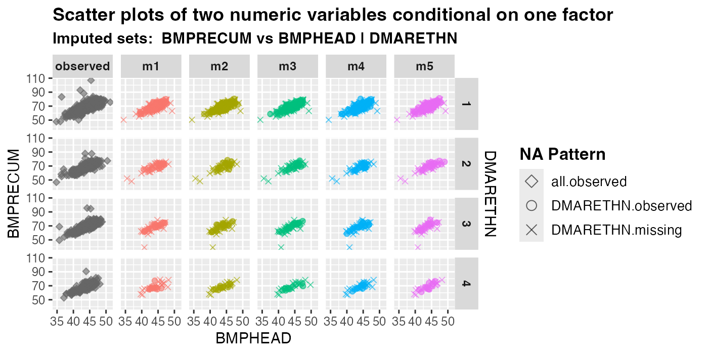

If we want to treat an integer variable as numeric, we can place it in
either `var.x` or `var.y`. Here is an example, where `HSAGEIR` is an
integer variable whose values range from 2 to 11.

``` r
plot_2num1fac(
  imputation.list = imputed.data, var.x = "HSAGEIR", var.y = "BMPRECUM",
  con.fac = "DMARETHN", original.data = withNA.df
)
```

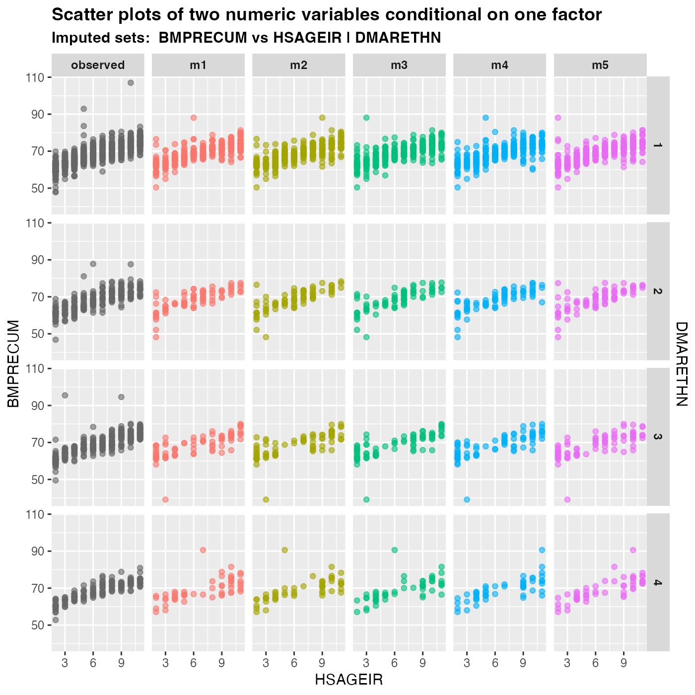

#### 2.3.2 One numeric variable and one factor conditional on another factor

The function [`plot_1num2fac()`](../../reference/plot_1num2fac.md)
generates boxplots with overlaying data points for a numeric variable
with a factor, conditional on another factor.

``` r
plot_1num2fac(
  imputation.list = imputed.data, var.fac = "DMARETHN", var.num = "BMPRECUM",
  con.fac = "HSSEX", original.data = withNA.df
)
```

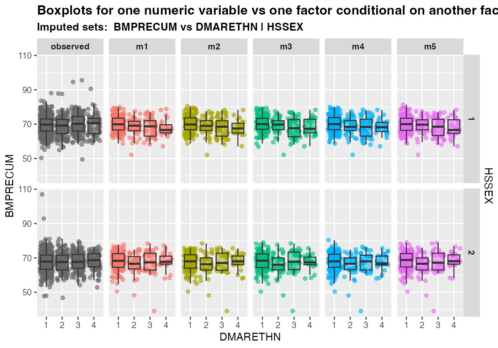

## 3 Color options

By default, the observed panel is gray and the other `m` panels use
`ggplot2`’s default color scheme.

``` r
plot_2num(
  imputation.list = imputed.data, var.x = "BMPHEAD", var.y = "BMPRECUM",
  original.data = withNA.df, color.pal = NULL
)
```

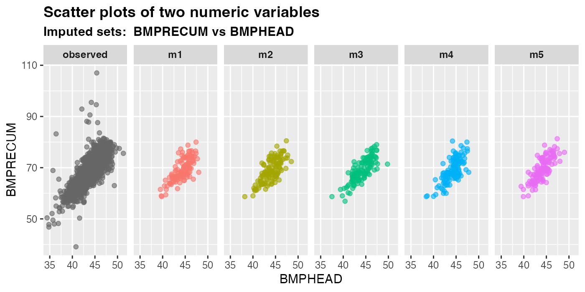

The `color.pal` argument allows users to specify a custom color palette
with a vector of hex codes, such as the colorblind-friendly palette
`Set2` from the R package `RColorBrewer`. Note that if there are `m`
imputed datasets, a vector of `m+1` hex codes is required because an
extra color is needed for the `Observed` panel.

``` r
library(RColorBrewer)
color.codes <- brewer.pal(n = 6, name = "Set2")
color.codes
#> [1] "#66C2A5" "#FC8D62" "#8DA0CB" "#E78AC3" "#A6D854" "#FFD92F"

plot_2num(
  imputation.list = imputed.data, var.x = "BMPHEAD", var.y = "BMPRECUM",
  original.data = withNA.df, color.pal = color.codes
)
```

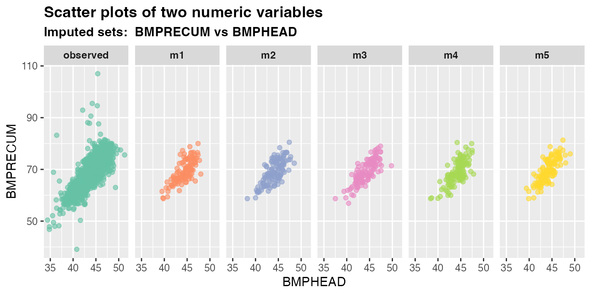

Otherwise, we can provide a vector of R’s built-in color names.

``` r
color.names <- c("gray50", "coral2", "goldenrod3", "darkolivegreen4", "slateblue1", "plum3")

plot_2num(
  imputation.list = imputed.data, var.x = "BMPHEAD", var.y = "BMPRECUM",
  original.data = withNA.df, color.pal = color.names
)
```

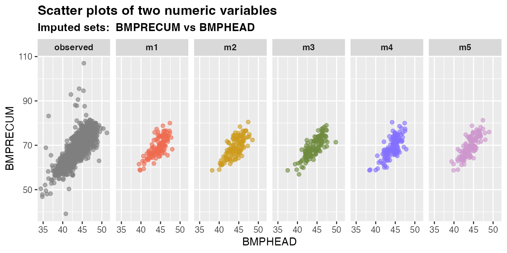

Here is a very useful cheat sheet of R colors names created by Dr Ying
Wei.

[http://www.stat.columbia.edu/\\tzheng/files/Rcolor.pdf](http://www.stat.columbia.edu/~tzheng/files/Rcolor.pdf)

## 4 Plot multiply imputed data from other packages

We can also plot multiply imputed datasets obtaining from other
packages, such as `mice`. Here is an example using the `nhanes2` data
from `mice`.

This dataset consists of just 25 rows and 4 columns (`age`, `bmi`, `hyp`
and `chl`). There are only 9, 8 and 10 missing values in the variables
`bmi`, `hyp`, and `chl`, respectively. Note that imputed values are
volatile when the dataset is this small.

``` r
library(mice)
dim(nhanes2)
#> [1] 25  4
colSums(is.na(nhanes2))
#> age bmi hyp chl 
#>   0   9   8  10

imp <- mice(data = nhanes2, m = 5, printFlag = FALSE)
mice.data <- complete(imp, action = "all")
```

``` r
plot_hist(imputation.list = mice.data, var.name = "bmi", original.data = nhanes2)
```

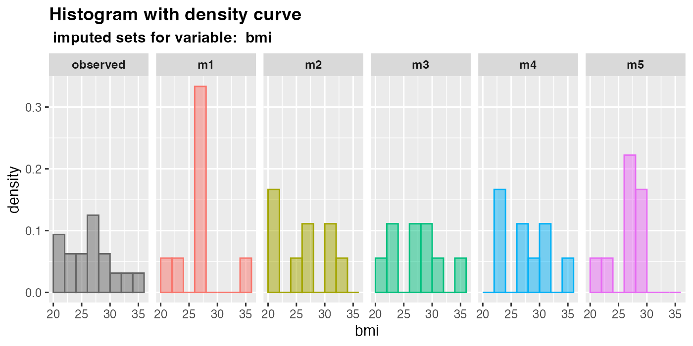

``` r
plot_box(imputation.list = mice.data, var.name = "chl", original.data = nhanes2)
```

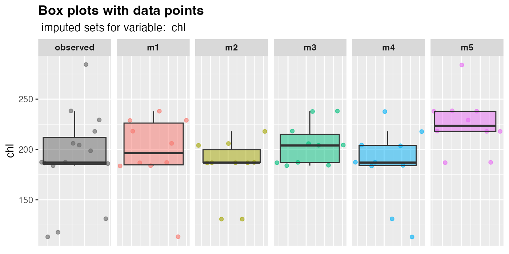

``` r
plot_bar(imputation.list = mice.data, var.name = "hyp", original.data = nhanes2)
```

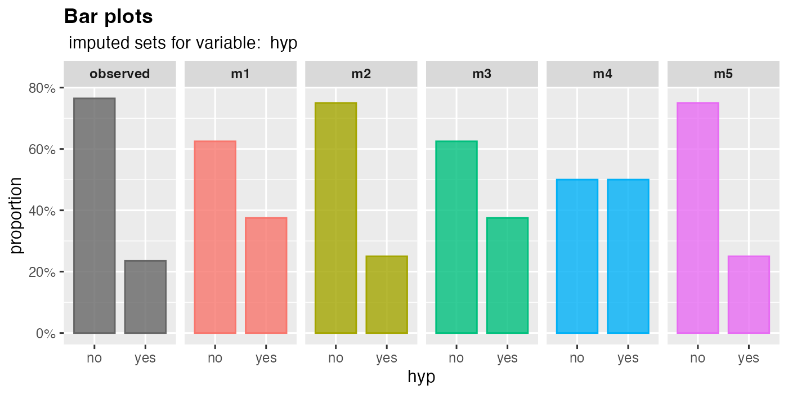

``` r
plot_2num(
  imputation.list = mice.data, var.x = "bmi", var.y = "chl",
  original.data = nhanes2
)
```

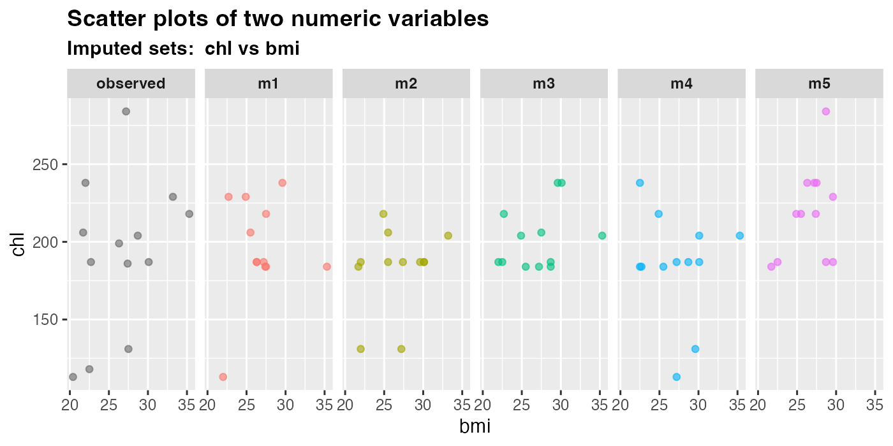

``` r
plot_1num1fac(
  imputation.list = mice.data, var.num = "chl", var.fac = "hyp",
  original.data = nhanes2
)
```

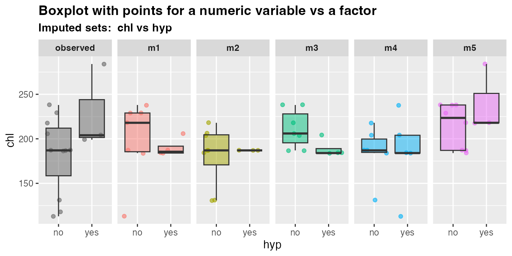

``` r
plot_2num1fac(
  imputation.list = mice.data, var.x = "chl", var.y = "bmi",
  con.fac = "age", original.data = nhanes2
)
```

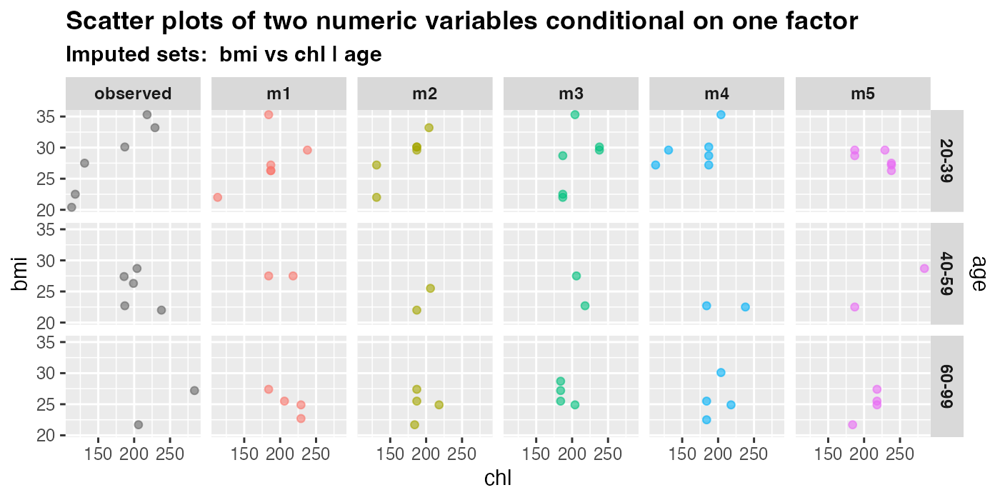

``` r
plot_2num1fac(
  imputation.list = mice.data, var.x = "chl", var.y = "bmi",
  con.fac = "hyp", original.data = nhanes2
)
```

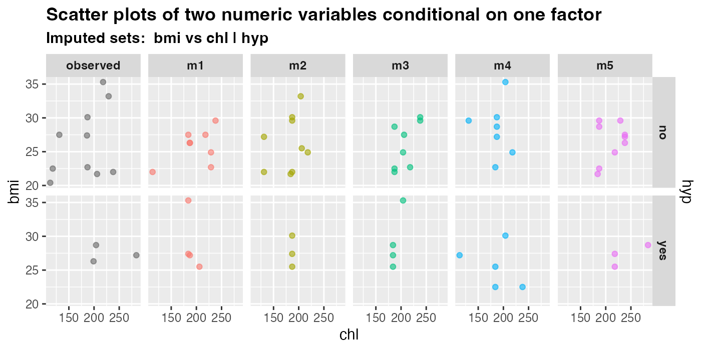

## 5 Plot against masked true values

In general, we do not know the true values of the missing data, thus we
can only plot the imputed values versus the observed data. However, if
we happen to know the true values (e.g., in cases where it is generated
by simulation), we may compare them to the imputed values.

Let us generate a simple dataset `full.df` and create 30% missing values
in variable `norm1` and `norm2` under the MCAR mechanism. We then impute
the `MCAR.df` dataset with [`mixgb()`](../../reference/mixgb.md).

``` r
N <- 1000
norm1 <- rnorm(n = N, mean = 1, sd = 1)
norm2 <- rnorm(n = N, mean = 1, sd = 1)
y <- norm1 + norm2 + norm1 * norm2 + rnorm(n = N, mean = 0, sd = 1)
full.df <- data.frame(y = y, norm1 = norm1, norm2 = norm2)
MCAR.df <- createNA(data = full.df, var.names = c("norm1", "norm2"), p = c(0.3, 0.3))

mixgb.data <- mixgb(data = MCAR.df, m = 5, nrounds = 10, pmm.type = "auto")
```

If the true data is known, it can be specified in the argument
`true.data` in the visual diagnostic functions. The output will then
have an extra panel called `MaskedTrue`, which shows values originally
observed but intentionally made missing.

``` r
plot_hist(
  imputation.list = mixgb.data, var.name = "norm1",
  original.data = MCAR.df, true.data = full.df
)
```

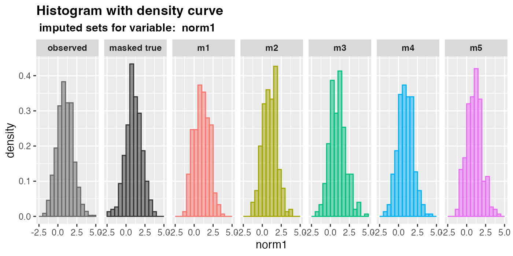

``` r
plot_box(
  imputation.list = mixgb.data, var.name = "norm2",
  original.data = MCAR.df, true.data = full.df
)
```

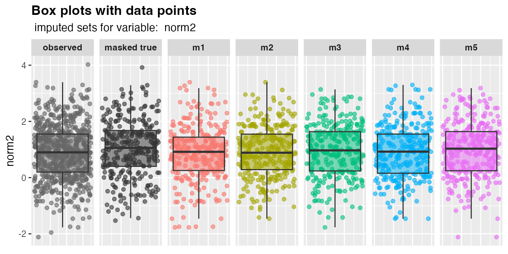

``` r
plot_2num(
  imputation.list = mixgb.data, var.x = "norm1", var.y = "y",
  original.data = MCAR.df, true.data = full.df
)
```

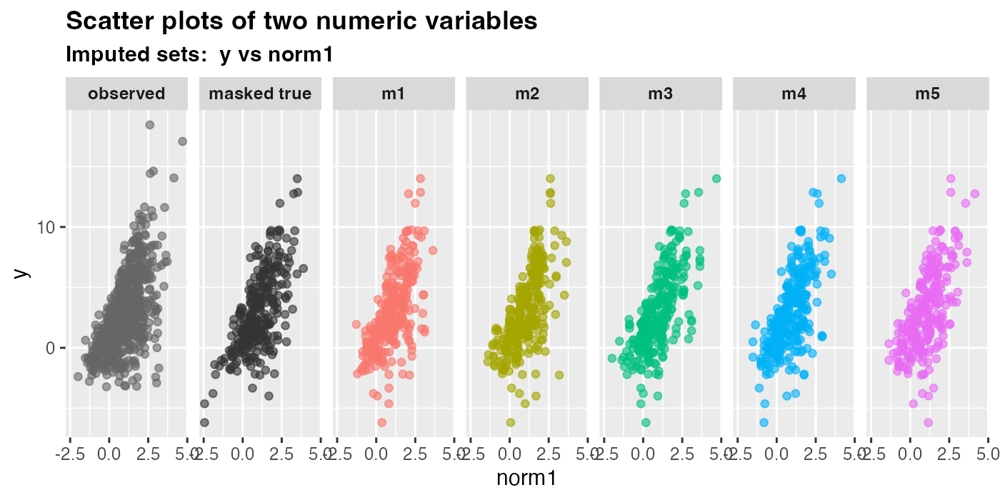
